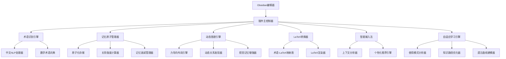
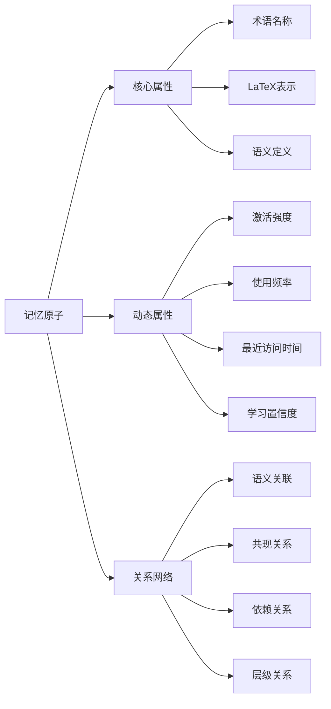

# 设计文档

## 概述

Obsidian数学记忆图谱插件基于**原子化记忆模块**的设计理念，将每个数学术语视为独立的记忆原子，通过动态关联和自适应增长机制构建个人化的数学知识网络。插件不仅是一个工具，更是一个会"学习"和"成长"的数学伙伴，能够随着用户的学习进程不断丰富和优化知识结构。

### 核心设计理念

1. **原子化记忆** - 每个数学概念都是独立的记忆单元，具有完整的语义信息
2. **动态增长** - 知识图谱随用户学习自动扩展，关系强度动态调整
3. **自适应学习** - 系统根据用户行为模式优化识别和推荐算法
4. **有机关联** - 术语间的关系不是预设的，而是通过使用模式自然形成
5. **记忆强化** - 频繁使用的概念和关系会得到强化，形成个性化的知识路径

## 架构

### 整体架构图



### 原子化记忆模块架构



### 核心架构原则

1. **模块化设计** - 每个功能模块独立开发和测试
2. **事件驱动** - 使用Obsidian的事件系统进行模块间通信
3. **数据持久化** - 本地SQLite数据库确保数据安全
4. **性能优化** - 异步处理和缓存机制
5. **可扩展性** - 支持自定义术语词典和LaTeX模板

## 组件和接口

### 1. 插件主控制器 (MainController)

**职责：** 插件生命周期管理、模块协调、设置管理

```typescript
interface IMainController {
    onload(): Promise<void>;
    onunload(): void;
    loadSettings(): Promise<PluginSettings>;
    saveSettings(): Promise<void>;
    registerEventHandlers(): void;
}

interface PluginSettings {
    enableAutoRecognition: boolean;
    enableGraphView: boolean;
    enableMathInput: boolean;
    recognitionSensitivity: number;
    customTermsPath: string;
    shortcutKeys: KeyboardShortcut[];
}
```

### 2. 术语识别引擎 (TermRecognitionEngine)

**职责：** 中文数学术语的智能识别和分类

```typescript
interface ITermRecognitionEngine {
    recognizeTerms(text: string): Promise<RecognizedTerm[]>;
    addCustomTerm(term: MathTerm): Promise<void>;
    updateTermDictionary(): Promise<void>;
    validateTerm(term: string): Promise<ValidationResult>;
}

interface RecognizedTerm {
    text: string;
    startIndex: number;
    endIndex: number;
    confidence: number;
    category: MathCategory;
    suggestedLatex: string;
}

interface MathTerm {
    chineseName: string;
    englishName?: string;
    category: MathCategory;
    latexCode: string;
    definition?: string;
    aliases: string[];
}

enum MathCategory {
    ALGEBRA = "代数",
    CALCULUS = "微积分",
    GEOMETRY = "几何",
    STATISTICS = "统计",
    LINEAR_ALGEBRA = "线性代数",
    DISCRETE_MATH = "离散数学"
}
```

### 3. 记忆原子管理器 (MemoryAtomManager)

**职责：** 原子化记忆单元的生命周期管理、动态属性更新和智能关联

```typescript
interface IMemoryAtomManager {
    // 原子生命周期管理
    createAtom(term: MathTerm): Promise<MemoryAtom>;
    activateAtom(atomId: string, context: UsageContext): Promise<void>;
    strengthenAtom(atomId: string, reinforcement: number): Promise<void>;
    decayAtoms(): Promise<void>; // 定期执行记忆衰减
    
    // 动态关联管理
    discoverRelations(atomId: string): Promise<AtomRelation[]>;
    strengthenRelation(sourceId: string, targetId: string, weight: number): Promise<void>;
    pruneWeakRelations(threshold: number): Promise<void>;
    
    // 智能检索
    findSimilarAtoms(atomId: string, similarity: number): Promise<MemoryAtom[]>;
    getAtomsByActivation(minActivation: number): Promise<MemoryAtom[]>;
    predictNextAtoms(currentAtoms: string[], context: UsageContext): Promise<MemoryAtom[]>;
}

interface MemoryAtom extends MathTerm {
    id: string;
    // 动态属性
    activationLevel: number;        // 当前激活强度 (0-1)
    memoryStrength: number;         // 记忆强度 (0-1)
    lastActivated: Date;           // 最后激活时间
    usageFrequency: number;        // 使用频率
    learningConfidence: number;    // 学习置信度
    
    // 上下文信息
    discoveryContext: string;      // 发现时的上下文
    primaryDomain: MathCategory;   // 主要领域
    semanticEmbedding?: number[];  // 语义向量表示
    
    // 关联网络
    strongRelations: Set<string>;  // 强关联的原子ID
    weakRelations: Set<string>;    // 弱关联的原子ID
    
    // 个性化属性
    userDifficulty: number;        // 用户感知难度 (0-1)
    masteryLevel: number;          // 掌握程度 (0-1)
    reviewPriority: number;        // 复习优先级
}

interface AtomRelation {
    sourceAtomId: string;
    targetAtomId: string;
    relationType: RelationType;
    strength: number;              // 关系强度 (0-1)
    confidence: number;            // 关系置信度
    discoveredAt: Date;
    lastReinforced: Date;
    coOccurrenceCount: number;     // 共现次数
    contextualRelevance: number;   // 上下文相关性
}

interface UsageContext {
    noteId: string;
    notePath: string;
    surroundingTerms: string[];
    mathDomain: MathCategory;
    userIntent: 'learning' | 'reviewing' | 'applying';
    sessionId: string;
}

interface TermRelation {
    sourceTermId: string;
    targetTermId: string;
    relationType: RelationType;
    strength: number;
    noteIds: string[];
}

enum RelationType {
    APPEARS_WITH = "共现",
    DEPENDS_ON = "依赖",
    GENERALIZES = "泛化",
    SPECIALIZES = "特化"
}

interface TermStatistics {
    totalTerms: number;
    categoryCounts: Map<MathCategory, number>;
    mostUsedTerms: Array<{term: MathTerm, count: number}>;
    recentlyAdded: MathTerm[];
}
```

### 4. 图谱可视化器 (GraphVisualizer)

**职责：** 数学概念关系的可视化展示

```typescript
interface IGraphVisualizer {
    renderGraph(container: HTMLElement): Promise<void>;
    updateGraph(terms: MathTerm[], relations: TermRelation[]): Promise<void>;
    highlightNode(termId: string): void;
    filterByCategory(categories: MathCategory[]): void;
    searchAndHighlight(query: string): void;
    exportGraph(format: 'svg' | 'png'): Promise<Blob>;
}

interface GraphNode {
    id: string;
    label: string;
    category: MathCategory;
    size: number;
    color: string;
    x?: number;
    y?: number;
}

interface GraphEdge {
    source: string;
    target: string;
    weight: number;
    type: RelationType;
    color: string;
}

interface GraphConfig {
    nodeSize: {min: number, max: number};
    edgeThickness: {min: number, max: number};
    colorScheme: Map<MathCategory, string>;
    layout: 'force' | 'circular' | 'hierarchical';
    showLabels: boolean;
    enableZoom: boolean;
}
```

### 5. LaTeX转换器 (LaTeXConverter)

**职责：** 数学术语到LaTeX代码的转换和渲染

```typescript
interface ILaTeXConverter {
    convertTerm(term: string): Promise<LaTeXResult>;
    renderLatex(latexCode: string): Promise<HTMLElement>;
    validateLatex(latexCode: string): Promise<ValidationResult>;
    getLatexTemplates(category: MathCategory): Promise<LaTeXTemplate[]>;
    customizeLatex(termId: string, latexCode: string): Promise<void>;
}

interface LaTeXResult {
    originalTerm: string;
    latexCode: string;
    renderedHtml: string;
    confidence: number;
    alternatives: string[];
}

interface LaTeXTemplate {
    name: string;
    category: MathCategory;
    template: string;
    placeholders: string[];
    description: string;
}

interface ValidationResult {
    isValid: boolean;
    errors: string[];
    warnings: string[];
    suggestions: string[];
}
```

### 6. 智能输入法 (SmartMathInput)

**职责：** 基于上下文的数学公式自动补全

### 7. 自适应学习引擎 (AdaptiveLearningEngine)

**职责：** 分析用户学习模式，优化记忆原子的激活和关联策略

```typescript
interface IAdaptiveLearningEngine {
    // 学习模式分析
    analyzeUsagePatterns(userId: string): Promise<LearningProfile>;
    updateLearningModel(interactions: UserInteraction[]): Promise<void>;
    predictDifficulty(atomId: string, userId: string): Promise<number>;
    
    // 记忆强化策略
    calculateOptimalReviewTime(atomId: string): Promise<Date>;
    adjustMemoryStrength(atomId: string, performance: number): Promise<void>;
    identifyWeakConnections(): Promise<AtomRelation[]>;
    
    // 个性化推荐
    recommendNextConcepts(currentAtoms: string[]): Promise<MemoryAtom[]>;
    generateLearningPath(targetConcept: string): Promise<LearningPath>;
    adaptInputSuggestions(context: InputContext, userProfile: LearningProfile): Promise<Suggestion[]>;
}

interface LearningProfile {
    userId: string;
    preferredCategories: MathCategory[];
    learningSpeed: number;           // 学习速度系数
    retentionRate: number;          // 记忆保持率
    difficultyPreference: number;   // 难度偏好 (0-1)
    activeHours: number[];          // 活跃时间段
    conceptualVsProceduralBias: number; // 概念vs程序偏好
    
    // 动态调整的参数
    currentFocusArea: MathCategory;
    masteryDistribution: Map<MathCategory, number>;
    forgettingCurveParams: ForgettingCurveModel;
}

interface UserInteraction {
    atomId: string;
    interactionType: 'view' | 'edit' | 'search' | 'link' | 'review';
    duration: number;
    success: boolean;
    context: UsageContext;
    timestamp: Date;
}

interface LearningPath {
    targetAtomId: string;
    steps: LearningStep[];
    estimatedDuration: number;
    difficultyProgression: number[];
}

interface LearningStep {
    atomId: string;
    prerequisiteAtoms: string[];
    estimatedTime: number;
    reviewCount: number;
    masteryThreshold: number;
}

interface ForgettingCurveModel {
    initialStrength: number;
    decayRate: number;
    stabilityFactor: number;
    retrievalStrength: number;
}

interface ISmartMathInput {
    activate(editor: Editor): void;
    deactivate(): void;
    getSuggestions(input: string, context: InputContext): Promise<Suggestion[]>;
    insertSuggestion(suggestion: Suggestion, editor: Editor): void;
    learnFromUsage(input: string, selected: string): Promise<void>;
}

interface InputContext {
    currentNote: string;
    surroundingText: string;
    detectedCategory: MathCategory;
    recentTerms: string[];
    cursorPosition: number;
}

interface Suggestion {
    text: string;
    latexCode: string;
    description: string;
    score: number;
    type: 'term' | 'formula' | 'template';
    category: MathCategory;
}
```

## 数据模型

### 原子化记忆数据库架构

```sql
-- 记忆原子表 (核心表)
CREATE TABLE memory_atoms (
    id TEXT PRIMARY KEY,
    chinese_name TEXT NOT NULL,
    english_name TEXT,
    category TEXT NOT NULL,
    latex_code TEXT NOT NULL,
    definition TEXT,
    aliases TEXT, -- JSON数组
    
    -- 动态属性
    activation_level REAL DEFAULT 0.0,     -- 激活强度 (0-1)
    memory_strength REAL DEFAULT 1.0,      -- 记忆强度 (0-1)
    last_activated DATETIME,               -- 最后激活时间
    usage_frequency INTEGER DEFAULT 0,     -- 使用频率
    learning_confidence REAL DEFAULT 0.5,  -- 学习置信度
    
    -- 上下文信息
    discovery_context TEXT,                -- 发现时的上下文
    primary_domain TEXT,                   -- 主要领域
    semantic_embedding TEXT,               -- 语义向量 (JSON)
    
    -- 个性化属性
    user_difficulty REAL DEFAULT 0.5,     -- 用户感知难度
    mastery_level REAL DEFAULT 0.0,       -- 掌握程度
    review_priority REAL DEFAULT 0.5,     -- 复习优先级
    
    -- 时间戳
    created_at DATETIME DEFAULT CURRENT_TIMESTAMP,
    updated_at DATETIME DEFAULT CURRENT_TIMESTAMP
);

-- 原子关系表 (动态关系)
CREATE TABLE atom_relations (
    id TEXT PRIMARY KEY,
    source_atom_id TEXT NOT NULL,
    target_atom_id TEXT NOT NULL,
    relation_type TEXT NOT NULL,
    
    -- 动态关系属性
    strength REAL DEFAULT 0.1,            -- 关系强度 (0-1)
    confidence REAL DEFAULT 0.5,          -- 关系置信度
    co_occurrence_count INTEGER DEFAULT 1, -- 共现次数
    contextual_relevance REAL DEFAULT 0.5, -- 上下文相关性
    
    -- 时间信息
    discovered_at DATETIME DEFAULT CURRENT_TIMESTAMP,
    last_reinforced DATETIME DEFAULT CURRENT_TIMESTAMP,
    
    FOREIGN KEY (source_atom_id) REFERENCES memory_atoms(id),
    FOREIGN KEY (target_atom_id) REFERENCES memory_atoms(id),
    UNIQUE(source_atom_id, target_atom_id, relation_type)
);

-- 用户交互记录表 (学习行为分析)
CREATE TABLE user_interactions (
    id TEXT PRIMARY KEY,
    atom_id TEXT NOT NULL,
    interaction_type TEXT NOT NULL, -- 'view', 'edit', 'search', 'link', 'review'
    duration INTEGER DEFAULT 0,     -- 交互持续时间(秒)
    success BOOLEAN DEFAULT TRUE,   -- 交互是否成功
    
    -- 上下文信息
    note_id TEXT,
    note_path TEXT,
    surrounding_terms TEXT,         -- JSON数组
    math_domain TEXT,
    user_intent TEXT,              -- 'learning', 'reviewing', 'applying'
    session_id TEXT,
    
    timestamp DATETIME DEFAULT CURRENT_TIMESTAMP,
    FOREIGN KEY (atom_id) REFERENCES memory_atoms(id)
);

-- 学习档案表 (个性化学习模型)
CREATE TABLE learning_profiles (
    id TEXT PRIMARY KEY,
    user_id TEXT NOT NULL,
    
    -- 学习偏好
    preferred_categories TEXT,              -- JSON数组
    learning_speed REAL DEFAULT 1.0,       -- 学习速度系数
    retention_rate REAL DEFAULT 0.8,       -- 记忆保持率
    difficulty_preference REAL DEFAULT 0.5, -- 难度偏好
    active_hours TEXT,                      -- JSON数组，活跃时间段
    conceptual_vs_procedural_bias REAL DEFAULT 0.5,
    
    -- 动态状态
    current_focus_area TEXT,               -- 当前关注领域
    mastery_distribution TEXT,             -- JSON对象，各领域掌握度
    forgetting_curve_params TEXT,          -- JSON对象，遗忘曲线参数
    
    created_at DATETIME DEFAULT CURRENT_TIMESTAMP,
    updated_at DATETIME DEFAULT CURRENT_TIMESTAMP
);

-- 学习路径表 (自适应学习路径)
CREATE TABLE learning_paths (
    id TEXT PRIMARY KEY,
    user_id TEXT NOT NULL,
    target_atom_id TEXT NOT NULL,
    
    -- 路径信息
    steps TEXT NOT NULL,                   -- JSON数组，学习步骤
    estimated_duration INTEGER,           -- 预估时长(分钟)
    difficulty_progression TEXT,          -- JSON数组，难度递进
    current_step INTEGER DEFAULT 0,      -- 当前步骤
    completion_rate REAL DEFAULT 0.0,    -- 完成率
    
    created_at DATETIME DEFAULT CURRENT_TIMESTAMP,
    updated_at DATETIME DEFAULT CURRENT_TIMESTAMP,
    FOREIGN KEY (target_atom_id) REFERENCES memory_atoms(id)
);

-- 记忆衰减日志表 (记忆强度变化追踪)
CREATE TABLE memory_decay_log (
    id TEXT PRIMARY KEY,
    atom_id TEXT NOT NULL,
    old_strength REAL NOT NULL,
    new_strength REAL NOT NULL,
    decay_factor REAL NOT NULL,
    reason TEXT,                          -- 衰减原因
    timestamp DATETIME DEFAULT CURRENT_TIMESTAMP,
    FOREIGN KEY (atom_id) REFERENCES memory_atoms(id)
);

-- 自定义LaTeX表 (增强版)
CREATE TABLE custom_latex (
    id TEXT PRIMARY KEY,
    atom_id TEXT NOT NULL,
    latex_code TEXT NOT NULL,
    is_preferred BOOLEAN DEFAULT FALSE,
    usage_count INTEGER DEFAULT 0,       -- 使用次数
    user_rating REAL DEFAULT 0.0,        -- 用户评分
    created_at DATETIME DEFAULT CURRENT_TIMESTAMP,
    FOREIGN KEY (atom_id) REFERENCES memory_atoms(id)
);

-- 索引优化
CREATE INDEX idx_atoms_activation ON memory_atoms(activation_level DESC);
CREATE INDEX idx_atoms_category ON memory_atoms(category);
CREATE INDEX idx_atoms_last_activated ON memory_atoms(last_activated DESC);
CREATE INDEX idx_relations_strength ON atom_relations(strength DESC);
CREATE INDEX idx_interactions_timestamp ON user_interactions(timestamp DESC);
CREATE INDEX idx_interactions_atom ON user_interactions(atom_id);
```

### 内存数据结构

```typescript
// 术语索引缓存
class TermIndex {
    private termsByCategory: Map<MathCategory, Set<string>>;
    private termsByFirstChar: Map<string, Set<string>>;
    private latexMapping: Map<string, string>;
    private relationGraph: Map<string, Set<string>>;
    
    public buildIndex(terms: MathTerm[]): void;
    public searchByPrefix(prefix: string): MathTerm[];
    public getRelatedTerms(termId: string): MathTerm[];
}

// 上下文分析缓存
class ContextCache {
    private noteContexts: Map<string, NoteContext>;
    private recentTerms: Array<{term: string, timestamp: number}>;
    private categoryProbabilities: Map<MathCategory, number>;
    
    public updateContext(notePath: string, content: string): void;
    public getCurrentContext(): InputContext;
    public predictCategory(text: string): MathCategory;
}
```

## 错误处理

### 错误分类和处理策略

1. **数据库错误**
   - 连接失败：重试机制，降级到内存存储
   - 数据损坏：自动备份恢复，用户通知
   - 查询超时：查询优化，结果缓存

2. **术语识别错误**
   - 识别失败：记录日志，提供手动标记选项
   - 误识别：用户反馈机制，模型调优
   - 性能问题：分批处理，后台执行

3. **LaTeX渲染错误**
   - 语法错误：错误提示，建议修正
   - 渲染失败：降级到文本显示
   - 字体缺失：提供安装指导

4. **图谱渲染错误**
   - 数据过大：分页加载，性能优化
   - 布局计算失败：降级到简单布局
   - 浏览器兼容性：特性检测，优雅降级

```typescript
class ErrorHandler {
    public static handleDatabaseError(error: DatabaseError): void {
        switch (error.type) {
            case 'CONNECTION_FAILED':
                this.retryConnection();
                break;
            case 'QUERY_TIMEOUT':
                this.optimizeQuery(error.query);
                break;
            default:
                this.logError(error);
        }
    }
    
    public static handleRecognitionError(error: RecognitionError): void {
        // 错误处理逻辑
    }
}
```

## 测试策略

### 单元测试

1. **术语识别引擎测试**
   - 准确率测试：使用标准数学文本集
   - 性能测试：大文档处理时间
   - 边界条件测试：特殊字符、混合语言

2. **数据库管理器测试**
   - CRUD操作测试
   - 并发访问测试
   - 数据完整性测试

3. **LaTeX转换器测试**
   - 转换准确性测试
   - 渲染质量测试
   - 错误处理测试

### 集成测试

1. **插件集成测试**
   - Obsidian API兼容性
   - 多模块协作测试
   - 用户工作流测试

2. **性能测试**
   - 大量术语处理性能
   - 图谱渲染性能
   - 内存使用监控

### 用户验收测试

1. **功能完整性测试**
   - 核心功能验证
   - 用户界面测试
   - 快捷键和交互测试

2. **可用性测试**
   - 学习曲线评估
   - 错误恢复测试
   - 文档完整性检查

```typescript
// 测试工具类
class TestUtils {
    public static generateMockTerms(count: number): MathTerm[];
    public static createTestDatabase(): Promise<IDatabaseManager>;
    public static simulateUserInput(text: string): InputEvent;
    public static measurePerformance<T>(fn: () => T): {result: T, time: number};
}
```

## 性能优化

### 关键性能指标

1. **术语识别延迟** < 100ms (1000字符文本)
2. **图谱渲染时间** < 2s (500个节点)
3. **自动补全响应** < 50ms
4. **数据库查询** < 10ms (平均)
5. **内存使用** < 50MB (正常使用)

### 优化策略

1. **缓存机制**
   - 术语识别结果缓存
   - LaTeX渲染结果缓存
   - 图谱布局缓存

2. **异步处理**
   - 后台术语识别
   - 增量图谱更新
   - 延迟数据库写入

3. **数据结构优化**
   - 倒排索引加速搜索
   - 空间索引优化图谱
   - 压缩存储减少内存

```typescript
// 性能监控
class PerformanceMonitor {
    private metrics: Map<string, PerformanceMetric>;
    
    public startTimer(operation: string): string;
    public endTimer(timerId: string): number;
    public recordMemoryUsage(): void;
    public generateReport(): PerformanceReport;
}
```